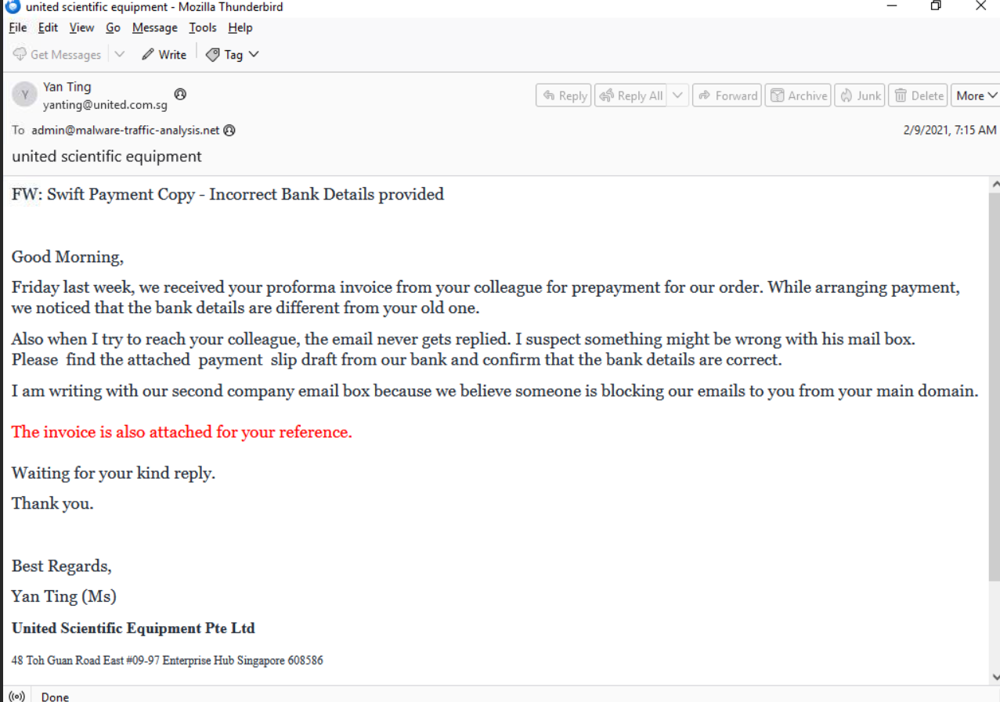
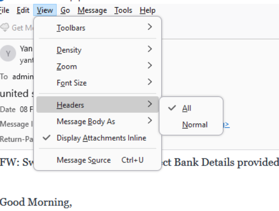
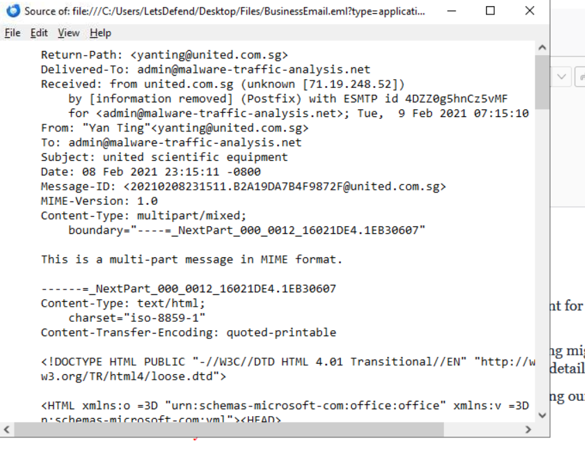
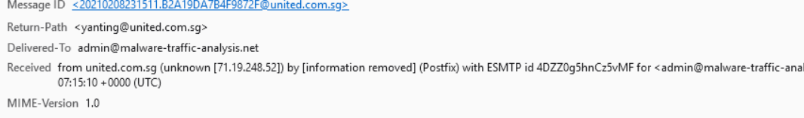
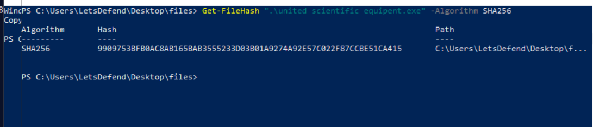
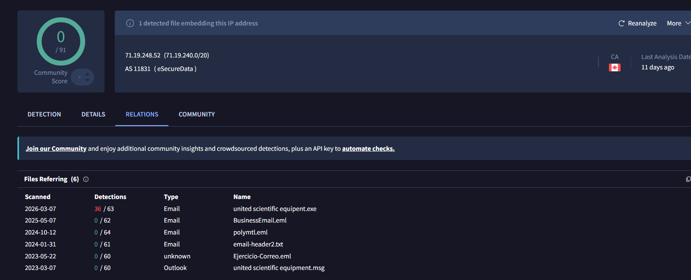
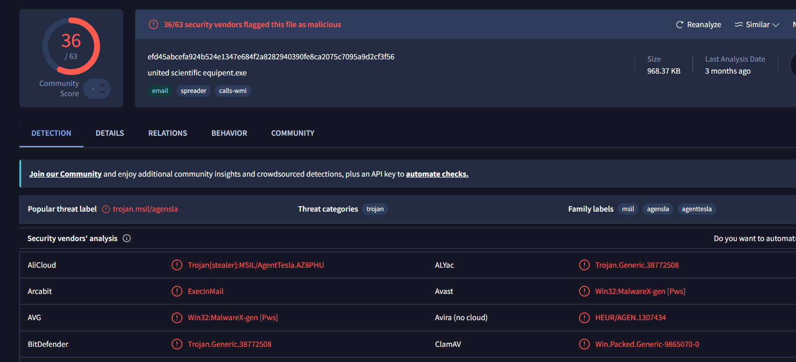
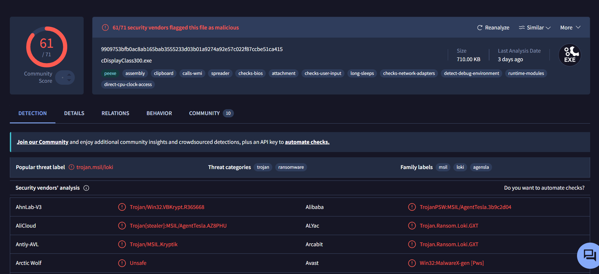
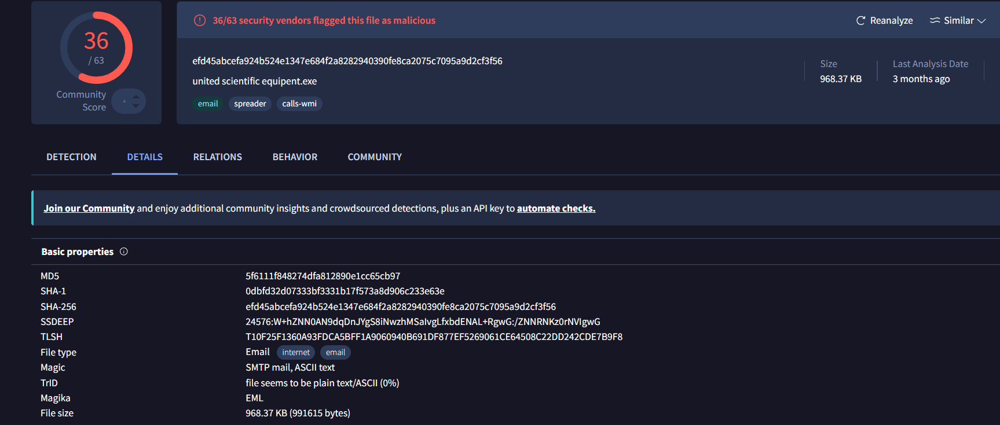

# Phishing & Malware Analysis Report: United Scientific Impersonation

##  Overview
This project documents the investigation and technical analysis of a suspicious Business Email Compromise (BEC) and phishing campaign targeting a company infrastructure. The analysis covers email header forensics, attachment extraction, and malware reputation assessment via threat intelligence platforms.

---

##  Investigation Breakdown

### 1. Initial Email Triage
* **Subject:** `FW: Swift Payment Copy - Incorrect Bank Details provided`
* **Sender:** `Yan Ting <yanting@united.com.sg>`
* **Recipient:** `admin@malware-traffic-analysis.net`
* **Date:** Tue, 9 Feb 2021 07:15:10 UTC

Upon inspecting the email body, several social engineering indicators were present. The attacker claims that the bank details have changed and requests a review of an attached document. They also justify the usage of an alternative mailbox due to "domain blocking" issues.

---

### 2. Header Forensics
To look beyond the displayed display name, we extracted the raw email headers via Thunderbird:

Analyzing the raw internet headers revealed the actual mail infrastructure path:
* **Return-Path:** `<yanting@united.com.sg>`
* **Received IP:** `71.19.248.52`

The `Received:` header confirms the message originated from an external infrastructure belonging to `eSecureData` in Canada, confirming a spoofing or external delivery attempt mismatching the company's real local operations.

---

### 3. Malware & Artifact Analysis
The email carried an attached executable posing as an invoice/slip document, with a noticeable typo in the naming (`equipent` instead of `equipment`). 

Using PowerShell, the SHA-256 cryptographic hash of the file was computed to safely identify the threat:
* **File Name:** `united scientific equipent.exe`
* **SHA-256 Hash:** `9909753BFB0AC8AB165BAB3555233D03B01A9274A92E7C022F87CCBE51CA415`

---

### 4. Threat Intelligence Lookup
Pivoting the indicators on VirusTotal provided concrete confirmation regarding the nature of the attack:
* **IP Reputation:** The source IP address `71.19.248.52` is historically tightly mapped to several malicious `.eml` objects.
* **Malware Family & Severity:** Initial detection flags show 36/63 engines flagging the file, while deep rescans show a critical **61/71 security vendors flagging this file as malicious**. It is widely classified under the **AgentTesla** trojan family (`Trojan[stealer]:MSIL/AgentTesla`) and linked with **Loki** behavior.

---

##  Indicators of Compromise (IoCs)
An automation-ready list is maintained inside the [indicators_of_compromise.txt](./indicators_of_compromise.txt) file.

| Type | Indicator | Description |
| :--- | :--- | :--- |
| **IP Address** | `71.19.248.52` | Malicious Sender Infrastructure (eSecureData Canada) |
| **Domain** | `united.com.sg` | Spoofed/Impersonated Corporate Domain |
| **SHA-256 Hash** | `9909753bfb0ac8ab165bab3555233d03b01a9274a92e7c022f87ccbe51ca415` | `united scientific equipent.exe` (AgentTesla Info-Stealer) |

---

##  Conclusion & Remediation Plan
* **Verdict:** Malicious (Targeted Business Email Compromise + Spyware Campaign).
* **Remediation Actions:**
  1. **Network Level:** Block the malicious IP `71.19.248.52` at the perimeter email gateway and enterprise firewalls.
  2. **Endpoint Level:** Deploy an IOC sweep across the network using the SHA-256 hash to ensure no endpoint executed the payload. Isolate any infected host immediately.
  3. **User Awareness:** Flag the incident to security awareness training vectors highlighting the specific threat behavior discovered (spoofed domain alternative mailbox excuse).
